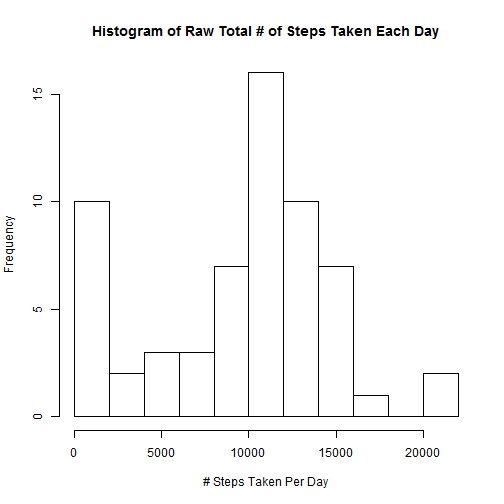
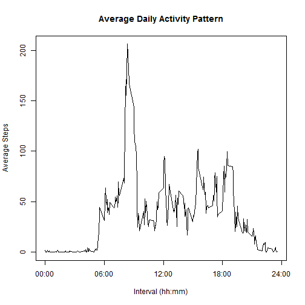
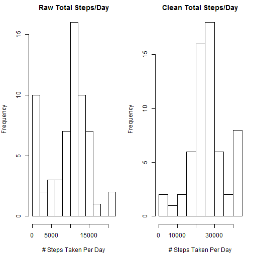
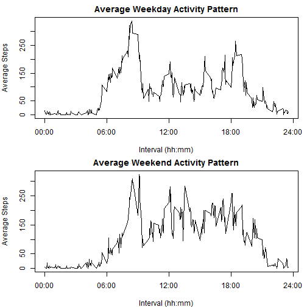

Joshua Poirier

## Loading and preprocessing the data
If it hasn't been unzipped, unzip the *activity.zip* file from the present working directory:

```r
if (!file.exists("activity.csv")) {
    unzip("activity.zip")
}
```

Load the data into a data frame called *data*:

```r
data <- read.csv("activity.csv", header=TRUE, nrows=17568, stringsAsFactors=FALSE)
```

Pre-process the data by formatting the *date* as a date object:

```r
library(lubridate)
data$date <- ymd(data$date)
```

Show some data!

```
##       steps       date interval
## 17566    NA 2012-11-30     2345
## 17567    NA 2012-11-30     2350
## 17568    NA 2012-11-30     2355
```

## What is mean total number of steps taken per day?
Build a new data frame from *data* that calculates the total number of steps taken on each day, and build a histogram:

```r
## aggregate data on 'date' field, summing the steps for each day
dailySteps <- aggregate(x=data$steps, by=list(data$date), FUN=sum, na.rm=TRUE)
names(dailySteps) <- c("Date", "TotalSteps")

## build histogram
hist(dailySteps$TotalSteps, 
     main="Histogram of Raw Total # of Steps Taken Each Day",
     xlab="# Steps Taken Per Day",
     breaks=10)
```

 

Let's calculate the **mean** and **median** total number of steps taken per day:

```r
meanTotalSteps <- mean(dailySteps$TotalSteps, na.rm=TRUE)
medianTotalSteps <- median(dailySteps$TotalSteps, na.rm=TRUE)
```

The mean total number of steps taken per day is **9354**; the median total number of steps taken per day is **1.0395 &times; 10<sup>4</sup>**.  We show zero decimal places here as the raw data has zero decimal places, meaning zero significant digits!

## What is the average daily activity pattern?
Build a new data frame from *data* that calculates the average daily activity pattern, and call it *dailyActivity*:

```r
## aggregate data on 'interval' field, finding the average steps taken for each interval
dailyActivity <- aggregate(x=data$steps, by=list(data$interval), FUN=mean, na.rm=TRUE)
names(dailyActivity) <- c("interval", "MeanSteps")
head(dailyActivity,3)
```

```
##   interval MeanSteps
## 1        0    1.7170
## 2        5    0.3396
## 3       10    0.1321
```

Let's create a time series plot of the mean steps:
 


```r
rowMaxSteps <- which.max(dailyActivity$MeanSteps)
maxSteps <- dailyActivity$MeanSteps[rowMaxSteps]
maxStepsInterval <- toString(dailyActivity$interval[rowMaxSteps])
maxStepsInterval <- formatC(maxStepsInterval, width=4, format="d", flag="0")
maxStepsInterval <- paste0(substr(maxStepsInterval,1,2), ":", substr(maxStepsInterval,3,4))
```

The average daily maximum number of steps taken per 5-minute interval is **206**, and is taken during **interval  8:35**.

## Imputing missing values
Let us calculate the total number of missing values in the dataset!

```r
missingSteps <- sum(is.na(data$steps))
missingIntervals <- sum(is.na(data$interval))
missingDates <- sum(is.na(data$date))
totalMissing <- missingSteps + missingIntervals + missingDates
```

The total number of missing values in the dataset is **2304**.

In the previous step, we computed the average number of steps taken for each interval.  Our strategy for imputing missing values will be to insert the value from the *dailyActivity* data frame for the corresponding interval.  

```r
library(dplyr)
## import average daily activity data frame into main data frame (linking on 'interval' field),
## then impute values from average daily activity
data <- left_join(data, dailyActivity, by="interval")
data$stepsClean <- apply(data,1,FUN=function(x) {if(is.na(x[1])) x[4] else x[1]})
print(data[2303:2311,])
```

```
##      steps       date interval MeanSteps stepsClean
## 2303    NA 2012-10-08     2350   0.22642    0.22642
## 2304    NA 2012-10-08     2355   1.07547    1.07547
## 2305     0 2012-10-09        0   1.71698          0
## 2306     0 2012-10-09        5   0.33962          0
## 2307     0 2012-10-09       10   0.13208          0
## 2308     0 2012-10-09       15   0.15094          0
## 2309     0 2012-10-09       20   0.07547          0
## 2310    13 2012-10-09       25   2.09434         13
## 2311    28 2012-10-09       30   0.52830         28
```

Notice how the *stepsClean* field took the *steps* field if it was numeric, and took the *MeanSteps* field if the *steps* field was missing.  

Let's also create a clean analytic data frame for moving forward:

```r
cleanData <- data.frame(date=data$date, interval=data$interval, steps=data$stepsClean)
class(cleanData$steps) <- "numeric"
```

Now let's re-build the histogram, and calculate the mean/median values to compare with our previous values.
 

The shapes of the histograms are similar; however, the values are doubled if not more!

Now let's see how our cleaning of the data affected the mean and median values.

```
##          Raw Clean
## Mean    9354 26378
## Median 10395 27111
```

Our approach to cleaning the data has nearly tripled the mean/median number of steps taken per day!  Was this the best approach to take?  How could it be improved?  These are important questions for future work.

## Are there differences in activity patterns between weekdays and weekends?
Create a new factor variable indicating whether the record is a *weekday* (Monday-Friday), or a *weekend day* (Saturday-Sunday).  We will also split the data frame into two separate data frames: one for weekday data, and another for weekend data.


```r
dayOfWeek <- weekdays(cleanData$date)
dayOfWeek <- sapply(dayOfWeek,
                   FUN=function(x) {
                       if(is.element(x, c("Monday", "Tuesday", "Wednesday", "Thursday", "Friday")))
                           as.factor("Weekday")
                       else as.factor("Weekend")
                       })
cleanData$weekday <- dayOfWeek

## split cleanData dataframe into weekday and weekend data frames - and calc averages for each interval
weekdayData <- cleanData$weekday == "Weekday"
weekendData <- cleanData$weekday == "Weekend"
weekdayData <- cleanData[weekdayData,]
weekendData <- cleanData[weekendData,]
weekdayActivity <- aggregate(x=weekdayData$steps, by=list(weekdayData$interval), FUN=mean)
names(weekdayActivity) <- c("interval", "MeanSteps")
weekendActivity <- aggregate(x=weekendData$steps, by=list(weekendData$interval), FUN=mean)
names(weekendActivity) <- c("interval", "MeanSteps")

head(cleanData,3)
```

```
##         date interval steps weekday
## 1 2012-10-01        0    39 Weekday
## 2 2012-10-01        5    13 Weekday
## 3 2012-10-01       10     5 Weekday
```
Here is a panel plot showing the difference for the average number of steps taken throughout the day if it is a weekday, or a weekend day.
 
