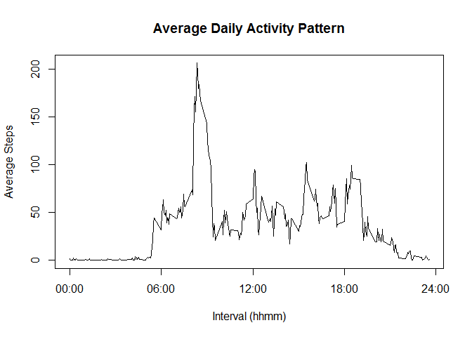

# Reproducible Research: Peer Assessment 1
Joshua Poirier

## Loading and preprocessing the data
If it hasn't been unzipped, unzip the *activity.zip* file from the present working directory:

```r
if (!file.exists("activity.csv")) {
    unzip("activity.zip")
}
```

Load the data into a data frame called *data*:

```r
data <- read.csv("activity.csv", header=TRUE, nrows=17568, stringsAsFactors=FALSE)
```

Pre-process the data by formatting the *date* as a date object:

```r
library(lubridate)
data$date <- ymd(data$date)
#data$time <- formatC(data$interval, width=4, format="d", flag="0")
#data$time <- paste0(substr(data$time,1,2), ":", substr(data$time,3,4))
#data$time <- hm(data$time)
```

Show some data!

```
##       steps       date interval
## 17566    NA 2012-11-30     2345
## 17567    NA 2012-11-30     2350
## 17568    NA 2012-11-30     2355
```

## What is mean total number of steps taken per day?
Build a new data frame from *data* that calculates the total number of steps taken on each day:

```r
## aggregate data on 'date' field, summing the steps for each day
dailySteps <- aggregate(x=data$steps, by=list(data$date), FUN=sum, na.rm=TRUE)
names(dailySteps) <- c("Date", "TotalSteps")
meanTotalSteps <- mean(dailySteps$TotalSteps)
head(dailySteps,3)
```

```
##         Date TotalSteps
## 1 2012-10-01          0
## 2 2012-10-02        126
## 3 2012-10-03      11352
```

The mean total number of steps taken per day is **9354**.  We show zero decimal places here as the raw data has zero decimal places, meaning zero significant digits!


## What is the average daily activity pattern?
Build a new data frame from *data* that calculates the average daily activity pattern, and call it *dailyActivity*:

```r
## aggregate data on 'interval' field, finding the average steps taken for each interval
dailyActivity <- aggregate(x=data$steps, by=list(data$interval), FUN=mean, na.rm=TRUE)
names(dailyActivity) <- c("interval", "MeanSteps")
head(dailyActivity,3)
```

```
##   interval MeanSteps
## 1        0    1.7170
## 2        5    0.3396
## 3       10    0.1321
```

Let's create a time series plot of the mean steps:
 

## Imputing missing values
In the previous step, we computed the average number of steps taken for each interval.  To impute missing values, let's insert the value from the *dailyActivity* data frame for the corresponding interval.  

```r
library(dplyr)
## import average daily activity data frame into main data frame (linking on 'interval' field),
## then impute values from average daily activity
data <- left_join(data, dailyActivity, by="interval")
data$stepsClean <- apply(data,1,FUN=function(x) {if(is.na(x[1])) x[4] else x[1]})
print(data[2303:2311,])
```

```
##      steps       date interval MeanSteps stepsClean
## 2303    NA 2012-10-08     2350   0.22642    0.22642
## 2304    NA 2012-10-08     2355   1.07547    1.07547
## 2305     0 2012-10-09        0   1.71698          0
## 2306     0 2012-10-09        5   0.33962          0
## 2307     0 2012-10-09       10   0.13208          0
## 2308     0 2012-10-09       15   0.15094          0
## 2309     0 2012-10-09       20   0.07547          0
## 2310    13 2012-10-09       25   2.09434         13
## 2311    28 2012-10-09       30   0.52830         28
```

Notice how the *stepsClean* field took the *steps* field if it was numeric, and took the *MeanSteps* field if the *steps* field was missing.  Let's also create a tidy analytic data frame for moving forward:

```r
tidyData <- data.frame(date=data$date, interval=data$interval, steps=data$stepsClean)
```

## Are there differences in activity patterns between weekdays and weekends?
